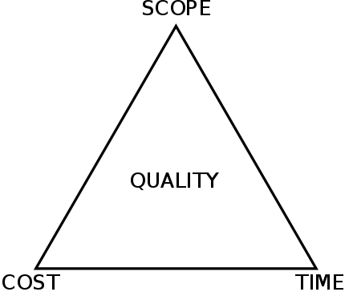
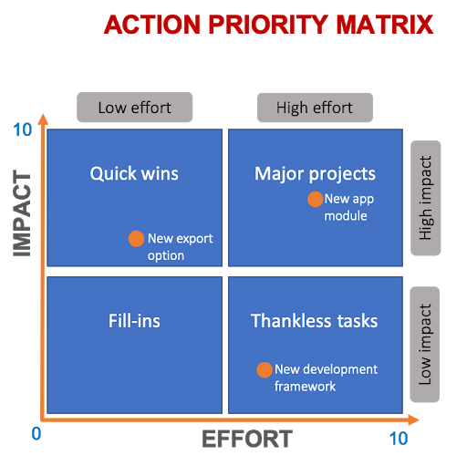
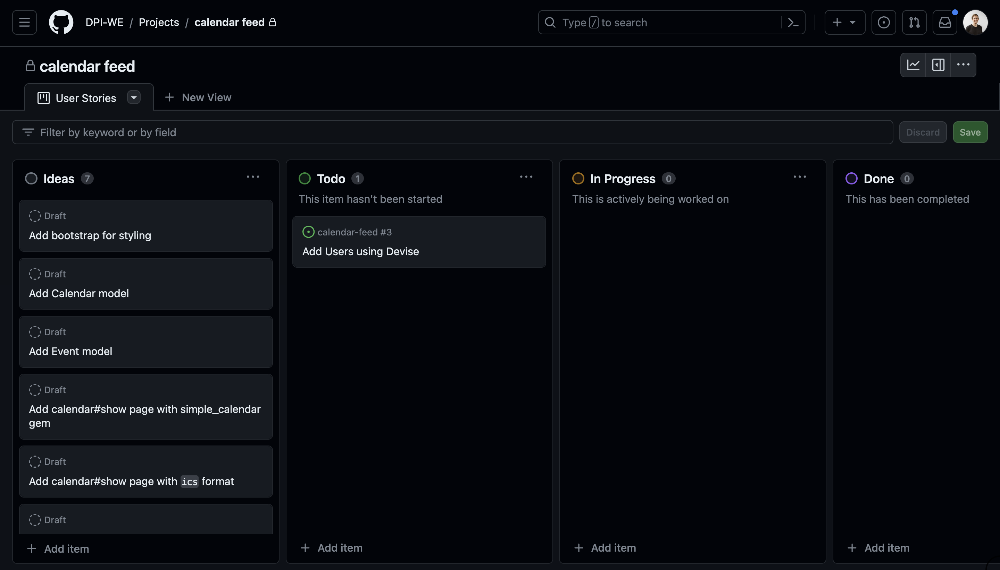

# Estimating and Prioritizing

This lesson explores techniques to estimate and prioritize work in software development, helping you effectively manage project scopes and timelines.

## Project Management Triangle

The Project Management Triangle illustrates the balance between three critical constraints: time, cost, and scope. It's much easier to decide on a budget and timeline, then pare down an initial feature set based on these constraints.

### Quiz Question
- What are the three constraints illustrated in the Project Management Triangle?
- Time, Cost, Scope
  - Correct! These are the three constraints that project managers must balance.
- Time, Quality, Scope
  - Not quite. Quality is important but not one of the primary constraints.
- Cost, Quality, Scope
  - Not quite. Quality is not one of the primary constraints.
{: .choose_best #triangle_constraints title="Project Management Triangle Constraints" points="1" answer="1" }

## Effort vs Impact

This matrix helps teams prioritize tasks based on their impact and the effort required. High-impact, low-effort tasks should be prioritized to maximize productivity. Use the Effort vs Impact matrix to visualize and prioritize tasks effectively.

<!-- TODO: maybe just do this exercise in class?

## Estimating Work

To estimate the amount of work required for tasks, we can use the following point system based on complexity:

- **1 Point**: A straightforward task that requires minimal implementation and integration effort. (Half workday)
- **3 Points**: Involves some additional functionality but is still relatively simple to implement. (1-2 workdays)
- **5 Points**: Involves moderate effort. (3 workdays)
- **8 Points**: Requires significant effort. (~5 workdays)
- **13 Points**: A more challenging and time-consuming task. (~10 workdays)

## Pointing Poker

Pointing Poker is a collaborative estimation technique where team members estimate the effort required for tasks by assigning points based on the system described above. 

### Example User Stories:
- As a user, I want to be able to search for products by their name, so that I can quickly find the items I'm interested in.
- As a user, I want to be able to register with my email and password, so that I can create an account and access the application.
- As a user, I want to receive email notifications whenever my order status changes, so that I can stay updated on the progress of my purchases.
- As a user, I want to be able to upload a profile picture, so that I can personalize my profile.
- As a user, I want to be able to create and manage multiple shopping lists, so that I can categorize my desired items for different occasions or stores.

### Quiz Question
- What is the purpose of Pointing Poker?
  - To allocate resources for the project.
    - Not quite. The purpose is to estimate task effort collaboratively.
  - To estimate the effort required for tasks collaboratively.
    - Correct! Pointing Poker is used for collaborative task estimation.
  - To determine project timelines.
    - Not quite. It's focused on estimating task effort, not timelines.
{: .choose_best #pointing_poker title="Purpose of Pointing Poker" points="1" answer="2" }

## Takeaways
- Regularly review and refine your estimates as project scope changes.
 -->

## Start Building a Backlog for Your Project

I recommend creating GitHub [Issues](https://docs.github.com/issues) and a [Project](https://docs.github.com/en/issues/planning-and-tracking-with-projects) to keep a backlog, prioritize and track progress. Please estimate and prioritize a few user stories (or break them down into smaller tasks). Make sure to make an estimate on effort and impact (high, medium, low, etc.). High impact and low effort tasks are usually good to work on first.

## Further Reading

- [A guide to producing software estimates](https://www.atlassian.com/agile/estimation)
- [A counterpoint: Why software estimation is a losing game](https://rclayton.silvrback.com/software-estimation-is-a-losing-game)
- [Building software with David Heinemeier Hansson](https://medium.com/computers-are-hard/computers-are-hard-building-software-with-david-heinemeier-hansson-c9025cdf225e)
- [Flaws in Scrum and Agile](https://pandastrike.com/posts/20150304-agile/)

---

- Approximately how long (in minutes) did this lesson take you to complete?
{: .free_text_number #time_taken title="Time taken" points="1" answer="any" }
